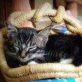
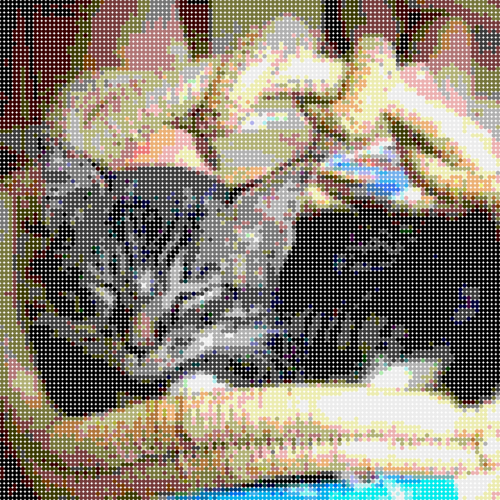
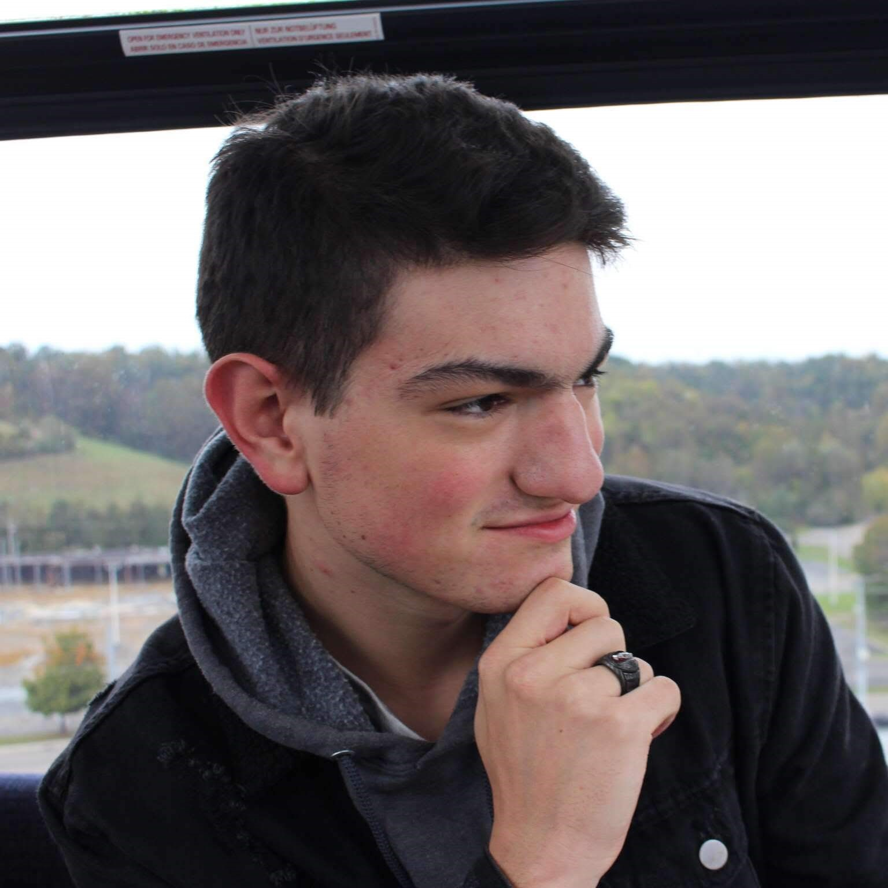
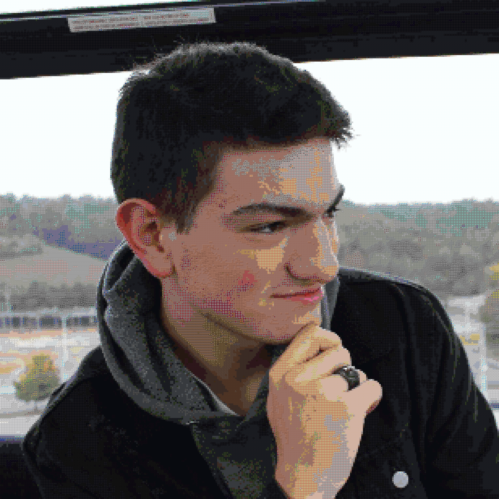
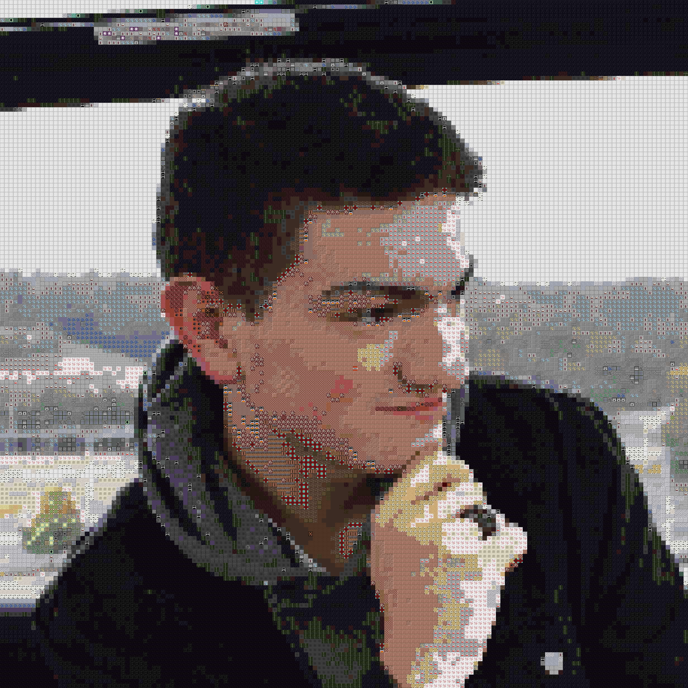

# Image Tiler
recreate images by tiling smaller images

# Files and Folders
## Folders
 - Images - place the image you want to tile here. there are some example images already in it.
 - Output - the tiled image will be placed in this folder when it is done. there are some example finished images in it.
 - Tiles - This folder contains folders for each tile type. Each tile type has folders for different sizes.
 
## Files
 - Main.py - This is the file you will run to tile an image, it has all the code for the tiler
 - misc.py - This file contains all the imports, and helper functions used in the tiler.
 
# Installation and usage
 1. clone the repo with `git clone https://github.com/GypsyDangerous/Image-Tiler.git`
 2. cd into the repo
 3. install all requirements from requirements.txt
 4. run main.py with your preffered python executor
 5. enter the name of you image
 6. enter what type of tile you want, you can see the available tile types in the Tiles folder
 7. enter the tile size you want. some tile types only support specific size while others support any size. Large tile could result in a memory error
 8. enter how much you want to scale down the resolution of the input image. put 1 if you want to keep the original resolution
 9. find your tiled image in the output folder.
 
# Credit
This project was inspired by [This](https://github.com/nuno-faria/tiler) repo but none of the code was copied. Some, but not all of the tiles have been copied, including the circles and the at symbols. I found said repo thanks to [This](https://www.youtube.com/watch?v=CHd4K_3rqKE) video.
 
# Examples
Due to fact that the tiler is stitching together images to make one large image. the output image will `tile size` times larger than the input image    

  
Original Image   
  
Scaled down to half the size of the original and tilled with 16x16 circles    

Tiled Image   

Original Image 
Scaled down to 1/5 the size of the original and tiled with 8x8 minecraft blocks
Tiled Image 
scaled down to 1/10 the size of the original and tiled with 16x16 minecraft blocks
Tiled Image 
